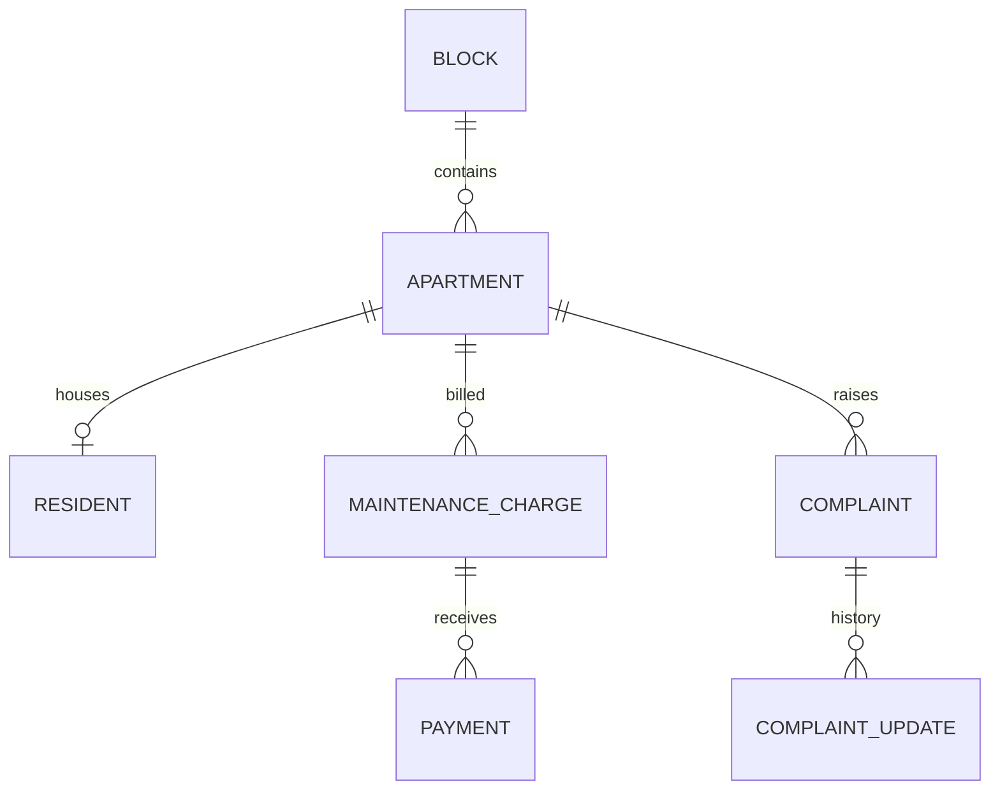
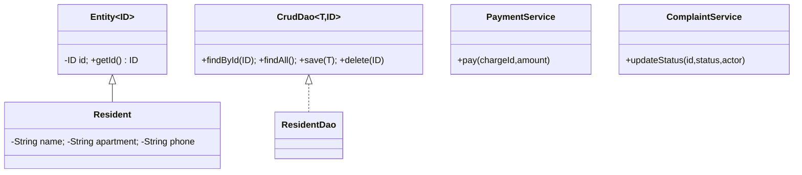
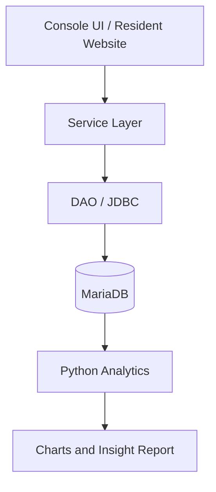

# System diagrams
## ER diagram

```mermaid
erDiagram
 BLOCK ||--o{ APARTMENT : contains
 APARTMENT ||--o| RESIDENT : houses
 APARTMENT ||--o{ MAINTENANCE_CHARGE : billed
 MAINTENANCE_CHARGE ||--o{ PAYMENT : receives
 APARTMENT ||--o{ COMPLAINT : raises
 COMPLAINT ||--o{ COMPLAINT_UPDATE : history
```
## Class diagram

```mermaid
classDiagram
 class Entity~ID~ { -ID id; +getId() ID }
 class Resident { -String name; -String apartment; -String phone }
 Entity <|-- Resident
 class CrudDao~T,ID~ { +findById(ID); +findAll(); +save(T); +delete(ID) }
 CrudDao <|.. ResidentDao
 class PaymentService { +pay(chargeId,amount) }
 class ComplaintService { +updateStatus(id,status,actor) }
```
## Layered architecture

```mermaid
flowchart TD
 UI[Console UI / Resident Website] --> S[Service Layer]
 S --> D[DAO / JDBC]
 D --> DB[(MariaDB)]
 DB --> PY[Python Analytics]
 PY --> R[Charts and Insight Report]
```
